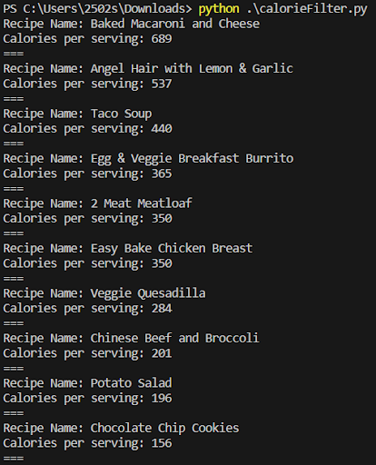
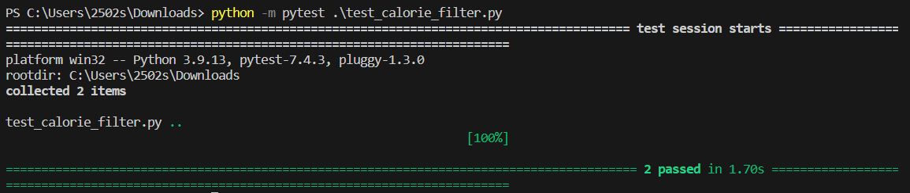

# Deliverable 4 : Group 2 Implementaion 1

## Introduction

The problem of planning meals throughout the busy week, especially with all the different dietary restrictions, affects everyone from on the go college students to young families. These issues cost people time, physical health, mental health, and performance in other aspects of their lives. Our product Pick-My-Meals is a free website that allows users to personally curate meals that fulfill their dietary needs through the use of custom filters. These filters allow users to select specific dietary needs or ingredients, that way they are provided with unique recipes. Unlike Hello Fresh our product is completely driven by user customization while not locking customers into frustrating subscriptions. Our product handles the grocery list by utilizing the customer’s location in order to find stores closest to them. Once a store is selected our product takes care of curating the grocery cart, saving the user time and money.

Github Link: https://github.com/caiton1/CS386-Meal-Creation-App-WIP-

## Implemented Requirements

### Implemented Requirement #1

**Requirement:** As a bodybuilder looking to cut weight, I want to be able to sort the recipes based on the approximate calories so that I can stay within my caloric deficit.

**Issue:** https://github.com/caiton1/CS386-Meal-Creation-App-WIP-/issues/33

**Pull request:** https://github.com/caiton1/CS386-Meal-Creation-App-WIP-/pull/66

**Implemented by:** Sophia Ingram

**Approved by:** Elleana Negrelli

**Print screen:** Shows the calories per serving listed from highest to lowest   
  
**Unit Test:**  

### Implemented Requirement #2

**Requirement:** As a vegetarian, I want creative meal ideas to meet my nutritional needs without eating mea

**Issue:** https://github.com/caiton1/CS386-Meal-Creation-App-WIP-/issues/28

**Pull request:** https://github.com/caiton1/CS386-Meal-Creation-App-WIP-/pull/77 

**Implemented by:** Elleana Negrelli

**Approved by:** Connor Aiton

**Print screen:**

### Implemented Requirement #3

**Requirement:** As a person with a nut allergy, I hope to be able to find recipes that avoid my allergies so that I don’t accidentally incur an allergic reaction.

**Issue:** https://github.com/caiton1/CS386-Meal-Creation-App-WIP-/issues/34

**Pull request:** https://github.com/caiton1/CS386-Meal-Creation-App-WIP-/pull/74

**Implemented by:** Isaiah Swank

**Approved by:** Elleana Negrelli

**Print screen:**

### Implemented Requirement #4

**Requirement:** As a young mom, I want to plan what I will be cooking throughout the week to better focus on other family tasks.

**Issue:** https://github.com/caiton1/CS386-Meal-Creation-App-WIP-/issues/30 

**Pull request:** https://github.com/caiton1/CS386-Meal-Creation-App-WIP-/pull/68

**Implemented by:** Aiden Seay

**Approved by:** Elleana Negrelli

**Print screen:** [NEED TO PUT PHOTO HERE]

### Implemented Requirement #5

**Requirement:** As a college student I want to be able to favorite good recipes so that I can quickly come back to them later

**Issue:** https://github.com/caiton1/CS386-Meal-Creation-App-WIP-/issues/24

**Pull request:** https://github.com/caiton1/CS386-Meal-Creation-App-WIP-/pull/55

**Implemented by:** Connor Aiton

**Approved by:** Elleana Negrelli

**Print screen:** 

Database showing the user data with favorites. Each recipe page has a favorite button that will add itself to this list (blacked out section is the unique id used to identify users, this database does not store password or username).

[NEED TO PUT PHOTO HERE]

### Implemented Requirement #6

**Requirement:** As a former student leaving college with loans, I want to organize what I eat so that I can be financially smart with my grocery purchases.

**Issue:** https://github.com/caiton1/CS386-Meal-Creation-App-WIP-/issues/29

**Pull request:** https://github.com/caiton1/CS386-Meal-Creation-App-WIP-/pull/58

**Implemented by:** Jared Brotamonte

**Approved by:** Elleana Negrelli

**Print screen:**

This is the result of my sort low to high function

[NEED TO PUT PHOTO HERE]

This is the result of my sort high to low function

[NEED TO PUT PHOTO HERE]

This is the result of me doing a low to high sort while using my filter_by_cost_range function to limit the search to within $10 - $17

[NEED TO PUT PHOTO HERE]

## Tests

https://github.com/caiton1/CS386-Meal-Creation-App-WIP-/tree/dev/website/unit_tests

## Adopted Technologies
### Cloud Infrastructure - Google Cloud 

[PUT REASONING HERE]

### Database - Firebase Realtime Database

[PUT REASONING HERE]

### Web Framework (Backend) - Python (flask + jinja)

[PUT REASONING HERE]

### Front end - HTML/CSS/JS

[PUT REASONING HERE]

## Learning/Training
In order to learn the adopted technologies, some of the resources we will be utilizing are Youtube and material from our ongoing course curriculum. Since Connor has more experience with some of the technologies we will be using, he will be able to assist in training the team. We also have a “useful links” channel on our Discord server that allows team members to share resources they have found to be helpful.

## Deployment

[PUT LINK FOR THE SYSTEM IN PRODUCTION] 

## Licensing

[TO DO]

## README File

**README File:** https://github.com/caiton1/CS386-Meal-Creation-App-WIP-/blob/main/README.md

**CONTRIBUTING File:** https://github.com/caiton1/CS386-Meal-Creation-App-WIP-/blob/main/CONTRIBUTING.md

**CODE_OF_CONDUCT File:** https://github.com/caiton1/CS386-Meal-Creation-App-WIP-/blob/main/LICENSE.md 

## Look and Feel

Our design will be simple and minimalistic with a bit of color to make it more interesting. We plan on possibly adding photos that users can upload and associate with the recipes to populate the page. For now we are mostly interested in getting the functionality to work.

[INCLUDE ALL OF THE SCREENSHOTS] 

## Lessons Learned

In retrospect, while we are happy with the implementation of our project, there are definitely some things we learned. The biggest aspect we took away from this is that we need more cohesion when it comes to how the workload is divided. While as a team we tried to play to each member's strengths, this left more work on some members as different aspects took more time. Another lesson we learned was how important communication is when working on a project, especially where not everyone is in the same room. For the second implementation we plan to have more intentional and intensive meetings going forward to better plan and breakdown what needs to be done. Along with having a daily check-in on what got done and the problems we are running into as we work to better brainstorm solutions.

## Demo

[INSERT VIDEO LINK HERE]
