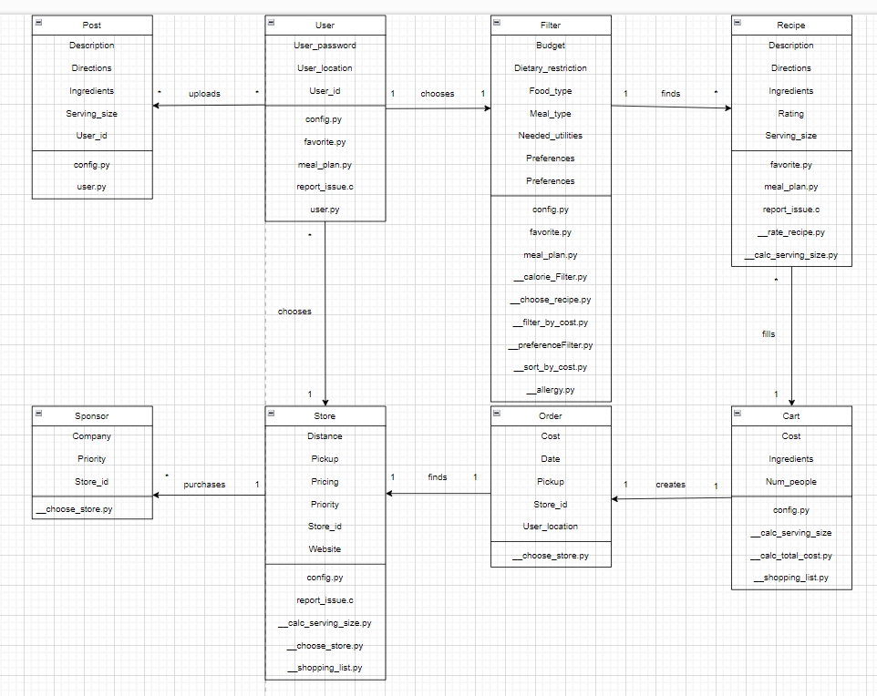

# Deliverable 5 Design : Group 2

## Description
Pick-My-Meals is a free meal-planning website. Our targets are those with busy lives and dietary needs like vegetarianism, or gluten-free. It allows users to pick curated recipes that fit their lifestyles and meet their dietary needs. Filters allow the user to specify whether they want recipes with specific ingredients, quick and easy meals, high protein, etc. We take care of calculating a detailed grocery list of what to buy, how much to get, and what it will cost. Pick-My-Meals stands out for the vast amount of recipes to choose from, unique filters, and the lack of subscription and shipping fees. While other products may ship the groceries to you, the uptick in porch pirates and the worry of food spoiling at your door brings unneeded stress. With us users know where their ingredients come from, it allows users to shop on a budget, or support local businesses. 

## Architecture

## Class Diagram

The implementation of our created functions is seen in the updated class diagram as the section underneath the original attributes of the classes. The functions used for each class are organized by public and private functions. The public functions are on the top of the list and are primarily functions that have to do with capturing and updating recipe, user, and store data. The private functions are indicated by the Python notation of private functions with the “__” in front of the function names.

**Implemented Function Relationships:**
* __allergy.py : returns a list of recipes filtered by the user inputted allergies
* __calc_total_cost.py : returns the total cost of the ingredients as an int
* __calorie_Filter.py : returns a list sorted of recipes with the highest calorie at the top 
* config.py : configures the database information, no return 
* favorite.py : updates the database for the user “favorites” section
* __filter_by_cost.py : returns a sorted list of recipes with the lowest cost at the top
* meal_plan.py : keeps track if a meal plan is completed, updates the database
* __prefereceFilter.py : returns a sorted list that contain the keywords in the description
* __sort_by_cost.py : calculates the total cost of each full recipe
* user.py : creates the user profile and captures data that needs to be updated the user in the database

**Not Yet Implemented Functions:**
* __calc_serving_size.py : calculates the amount of ingredients needed by the user indicated serving size
* __choose_recipe.py : appends the chosen recipe to the shopping list
* __choose_store.py : returns integer value based off of the store the user chooses
* __rate_recipe.py : updates the database for the rating the user gives a recipe
* report_issue.c : C function that sends an email based off of the complaint filed by the user
* __shopping_list.py : list of ingredients needed based off of the recipes and calculated serving size

## Sequence Diagram

## Design Patterns

### Structural Design Pattern
The design pattern used here is the adapter design pattern. This design pattern is like a converter so multiple classes can interact with each other. While in this specific example, we don’t use classes, it is the same idea. In order to store all of our data, we need a cloud database (Firebase). In order to get all of the information we need to use, we made user.py. user.py is responsible for converting information into data we can use on the website. This would best fit the adapter design pattern as the adapter from the database to the website is user.py.

LINKS:
* [views.py](https://github.com/caiton1/CS386-Meal-Creation-App-WIP-/blob/main/website/views.py)
* [user.py](https://github.com/caiton1/CS386-Meal-Creation-App-WIP-/blob/main/website/functions/user.py)

### Behavioral Design Pattern
The design pattern used here is the strategy design pattern. This design pattern defines a family of algorithms. An example of the strategy design pattern is used in the sort_by_cost functions. The UML class diagram for the strategy design pattern is below. The strategy is to sort meals by their cost. The context is the website for which the functions are sorting the meals for.

LINK:
* [sort_by_cost functions](https://github.com/caiton1/CS386-Meal-Creation-App-WIP-/blob/main/website/functions/sort_by_cost.py)

Disclaimer: This project doesn't use classes so we are stretching these examples to best fit the design patterns. 

## Design Principles
Our design observes the SOLID principles to a considerable extent. One instance in which our code follows the Single Responsibility Principle is in ‘favorite.py’. Each function, ‘add_favorite’, ‘remove_favorite’, and ‘is_favorited’, only has one single responsibility. This principle is adhered to in ‘preferenceFilter.py’ as well since the ‘filter_recipes’ function’s sole responsibility is to filter the recipes based on preference. This function also observes the Open/Closed Principle, seeing as it is closed for modification for the most part although it could be improved upon for extensibility. The Liskov Substitution Principle and Interface Segregation Principle are loosely demonstrated in the ‘UserData’ class within ‘user.py’. The class is open to data source substitutions without breaking the application, and each class and function has a specific responsibility without unnecessary methods although it does not explicitly use interfaces. The flask framework within ‘views.py’, including the use of ‘@app.route’ generally aligns with the Dependency Inversion Principle as it utilizes a level of abstraction for handling HTTP. We could improve on the implementation of this principle by introducing abstractions more frequently within other functions to allow for more flexibility without affecting higher-level modules. 

